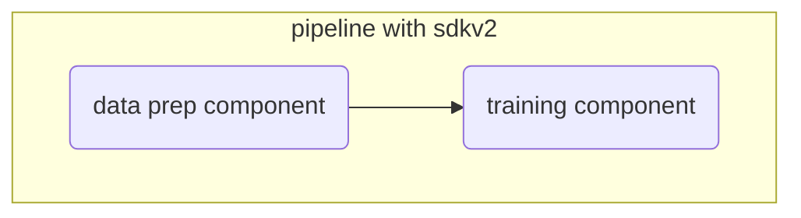
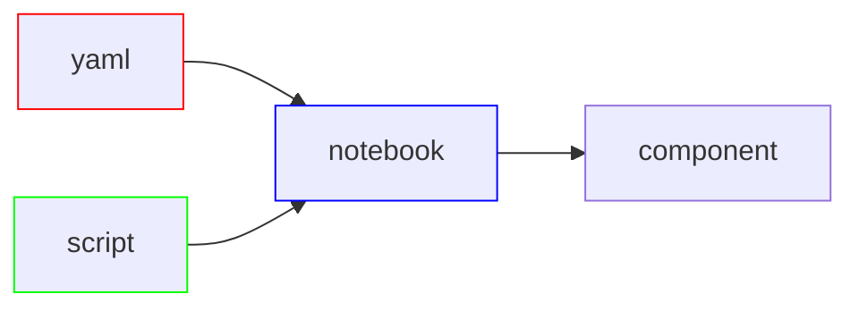

# About

This repo illustrates creating a machine learning pipeline in the cloud with the python sdk and used to develop a model to predict a patients blood pressure given several features e.g. insulin,BMI and many more. This is based on the UC Irvine Diabetes dataset found below.

https://archive.ics.uci.edu/dataset/34/diabetes

This scenario solves a regression problem, in this case a continuous numeric value for blood pressure. The main purpose is primarily to guide in the creation of a pipeline using Azure Machine Learning and the Python SDK.

## Creating Machine Learning Pipelines with Python SDKv2 in Azure Machine Learning

There are many ways to create pipelines in Azure Machine Learning. This method uses a programmatic approach with the Python SDK (software development kit). This approach is ideal for developing pipelines and experimenting. For production, I recommend the CLI and the AML extension which helps create a production grade pipeline.

The files are setup to follow a sequence of steps that mimic an ML workflow starting with _p01_.

## 1 development 

_p01_development.ipynb_

Assuming role of mlops or ml engineer we have received a notebook that creates a ml model.

## 2 productionalize

_p02_refactor.py_

1. We convert our notebook into a python script (.py) as pipelines jobs require scripts. However note, that I will ultimately create two scripts, one for each component found under the components folder.

2. To make things easier to manage we create functions from our steps.

3. This method also introduces the _argparse_ package which is used to read data into the python script or any other input such as a parameter. 

Note we have removed reference to our workspace and data filepaths.

### 2a - Components with Python SDKv2

We create components using two approaches, with Python SDK we define the structure of our component and another example we define a component with a yaml file.

At this level, we can specify compute and environment at the component level.

We start with python sdkv2 or the programmatic approach. 

_components/p03_data_prep.py_

We take our functions from the prep stage in our _p02_refactor.py_ script and make a few adjustments. This will become a separate independent component from our training portion of our pipeline and will be used to scale our features.

This will be the be the staging point for data ingestion into our pipeline, so we define two arguments. One for input which will be the data we ultimately want to use, and output which is the data that has been transformed and ready for training.

Within our _main()_ function we utlimately want to return our prepped data so we adjust our function to return data as a .csv and save it wo our output argument named _--prepped_data_. 

Arguments

_--input_data_ - argument that will refence filepath/filename name as it is defined as uri_file

_--prepped_data_ - argument that will reference filepath as it is defined as uri_folder

We will not provide the filepath just yet to our data and where to store our transformed data. At this point we are creating skeletons for our pipeline.

_p03_create_data_prep_component.ipynb_

We will create the actual component using a notebook with python sdks _command_ function. We also take an additional step and register this component into our AML workspace.

### 2b - Components with yaml

This approach defines our component using a yaml file. 

_p04_create_register_component.ipynb_

This notebook loads the yaml file and creates a component for us (note, script is defined in the yaml file).

_p04_training.yaml_

yaml file holding component inputs, outputs, script reference, and environment. 

_p04_training.py_

Our actual script that is executed when running the training component. 

## 3 create our pipeline

_p05_create_pipeline.ipynb_

This last notebook creates our pipeline. Because we didn't specify compute type in our components we specify the compute resource to run this pipeline. We can also define different computes per component, would make sense to use GPU or Spark Cluster for just the training component and CPU compute for data prep.

Benefits 

+ we have a pipeline stood up primarily python
+ 

Drawbacks

- reproducibility is important, CLI is best for this

